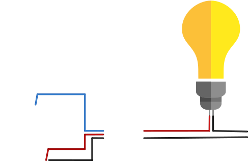

## About

This project is a personal project that worked with me and I wanted to share with the community. The idea is to turn on and off a lamp (of your bedroom, your living room...) by Wifi, that is, you don't need to get up of your bed to click the switch, you just take your phone, access the page which is responsible by your lamp and click to turn on or off. That's it. It's a great experience, my advice is to download this code, buy the wemos board, try to use it, make your changes, then try to think in something bigger and implement it. This is a good way to get more experience and learn more about these boards and other components. I'm having another ideas and soon I will make changes and test it.

### Tools

To make this project I used the following components and softwares:

- Arduino IDE - It can be found [here](https://www.arduino.cc/)
- Relé 1 chanel - Like [this one](https://http2.mlstatic.com/modulo-rele-1-canal-12v-automco-arduino-pic-raspberry-pic-D_NQ_NP_942429-MLB25661457738_062017-F.jpg)
- Jumpers - just to connect the pins
- Wemos D1 R2 - Like [this one](https://img.staticbg.com/thumb/view/oaupload/banggood/images/FB/1F/3892ad6b-3324-4790-bddf-0197ed6ca8f8.jpg)
- A Micro USB cable - To connect the Wemos with the Computer

## Getting Started

### Hardware configuration

<p align="center">
  
</p>

### Installing dependences

#### Arduino Software

To deploy the code to the wemos board you'll need to download and install the [Arduino Software](https://www.arduino.cc/en/Main/Software).

#### ESP8266 Library

The next important dependence is the wemos board configuration. With the Arduino Software opened, you go on menu File/Preferences and inside the "Additional Boards Manager URLs:" you paste this link:

```
http://arduino.esp8266.com/stable/package_esp8266com_index.json
```

After that, you go on menu _Tools/Board/Boards Manager_, wait for the window load, then you search for _esp8266_ and install the dependence **esp8266 by ESP8266 Community**. In my case I used the version _2.4.2_.

#### Wifi library

You will need also to download this library [here](https://github.com/Levysantiago/Wifi-Lamp/blob/master/WiFi.zip). After downloding it, you will move it to the _libraries_ folder from Arduino root folder then extract the _.zip_ file there.

### Configuring the platform

If you passed through the [Installing dependences](#installing-dependences) section, you already have the wemos board configuration installed in your Arduino Software.

To select the right configuration, you go on menu _Tools/Board_ and look for **LOLIN(WEMOS) D1 R2 & mini**. Then you go on menu Tools again and config the **Upload Speed** to **115200**. The Board configuration on Tools menu should be this way:

```
Board: "LOLIN(WEMOS) D1 R2 & mini"
Upload Speed: "115200"
CPU Frequency: "80 MHz"
Flash Size: "4M(1M SPIFFS)"
Debug port: "Disabled"
Debug Level: "None"
lwIPVariant: "v2 Lower Memory"
VTables: "Flash"
Erase Flash: "Only Sketch"
```

### Configuring the code

To the wemos board be allowed to connect to your network, you should edit the following code part:

```
const char *ssid = "yourNetworkName";
const char *password = "yourpassword";
```

- In _ssid_ you'll put your network/wifi name;
- The _password_ is the password to connect to your wifi;

Now you're able to send the code to the board.

**OBS.:** If you're on linux and the system isn't letting you access the board, you can try to give access by typing on the terminal the command below and replacing the _\[port\]_ with the port where the board is connected (usually USB0, ACM0...). You can check this on the Arduino Software too on menu _Tools/Port_.

```
$ sudo chmod a+rw /dev/tty/[port]
```
